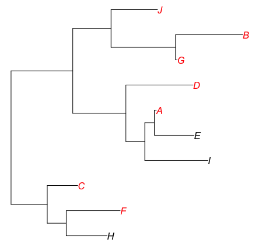
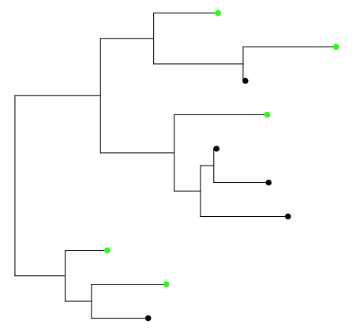

# saplings

This package is just all of the functions that I’ve created and that I use on a regular basis. In my mind they speed up components of a phylogenetic comparative workflow, e.g. seeing which species are in a tree, visualising the distribution of traits, trimming datasets to phylogenies.

## Instillation

Install straight from GitHub development page

```r
install.packages("devtools")
library(devtools)

install_github("adambakewell/saplings")
library(saplings)
```

## Latest updates

Version 0.0-2: [New function trait_overlap()](#trait_overlap), which allows you to give R a list of traits (or other variables in a data frame where rows are cases) and will return a matrix of the overlap between different traits.

## Examples
### u_in_tree
The `u_in_tree()` function allows you to quickly see whether a species or a list of species are within the phylogeny that you are using

```r
tree<-rtree(n=10, tip.label=LETTERS[1:10])		# simulate tree
u_in_tree(tree=tree, species=c('A','B','C','X','Y','Z'))   # ask whether it contains list of species

     Species In Phylogeny?
[1,] "A"     "TRUE"       
[2,] "B"     "TRUE"       
[3,] "C"     "TRUE"       
[4,] "X"     "FALSE"      
[5,] "Y"     "FALSE"      
[6,] "Z"     "FALSE"      
```

### tips_with_traits
The `tips_with_traits()` function allows you to visualise which tips on a phylogeny contain a trait of a combination of different traits

```r
# simulate tree
tree<-rtree(n=10, tip.label=LETTERS[1:10])

# and a data frame similar to one used for comparative analyses
Species<-LETTERS[1:10]
# if you leave your column with names in as Species then tips_with_traits will automatically match 
# species names to names on the phylogeny, otherwise specify names.col="my species column name" 
# in the main command
trait1<-c(1,5,3,2,NA,1,8,NA,NA,10)
trait2<-c(NA,4,2,2,1,3,NA,NA,1,2)
data<-data.frame(Species, trait1, trait2)

tips_with_traits(traits='trait1', data=data, tree=tree)
```



```r
# now an example with multiple traits, so it shows how a combination of traits going into a PGLS
# are distributed for example... instead of colouring the names you can mark the tips with dots.
tips_with_traits(traits=c('trait1', 'trait2'), data=data, tree=tree, ptype='tips', pres.col='green')
```



### trim_to_phy
It can be easy to forget to trim your original dataset to match the phylogeny. This is important when it comes to plotting figures, as if your species aren’t in the phylogeny then they won’t be in the model! The `trim_to_phy()` function does this in one step.

```r
# simulate a data frame as before
Species<-LETTERS[1:10]										
trait1<-c(1,5,3,2,NA,1,8,NA,NA,10)
trait2<-c(NA,4,2,2,1,3,NA,NA,1,2)
data<-data.frame(Species, trait1, trait2)

# simulate a tree
tree<-rtree(10, tip.label=LETTERS[seq(1, 20, by=2)])
LETTERS[seq(1, 20, by=2)]
# tree contains species called every second letter: A, C, E, G, I, K, M, O, Q, S... Data
# frame contains species called the first 10 letters of the alpahabet, those not
# matching the phylogeny (e.g. B, D...) should be removed before plotting

# data frame before
print(data)

   Species trait1 trait2
1        A      1     NA
2        B      5      4
3        C      3      2
4        D      2      2
5        E     NA      1
6        F      1      3
7        G      8     NA
8        H     NA     NA
9        I     NA      1
10       J     10      2

# trim data frame
trimmed_data<-trim_to_phy(data=data, tree=tree)
print(trimmed_data)

  Species trait1 trait2
1       A      1     NA
3       C      3      2
5       E     NA      1
7       G      8     NA
9       I     NA      1
```

### trim_equal_branch
The `trim_equal_branch()` function trims a phylogeny to fit a dataset, mainly for visualisation, it also sets equal branch lengths so that it can be used in comparative analysis.

```r
# simulate a phylogeny with no branch lengths
tree<-rtree(20, br=NULL, tip.label=LETTERS[1:20])

# simulate a dataset, here with only species called the second letters from A to T
Species<-LETTERS[seq(1, 20, by=2)]
trait1<-c(1,5,3,2,NA,1,8,NA,NA,10)
trait2<-c(NA,4,2,2,1,3,NA,NA,1,2)
data<-data.frame(Species, trait1, trait2)

# use function to trim phylogeny to dataset and set equal branch lengths
new_tree<-trim_equal_branch(tree=tree, species=data$Species)

# show old tree compared to new tree
par(mfrow=c(1,2))
plot(tree) ; text('before', x=2, y=20, font=2)
plot(new_tree); text('after', x=0.5, y=10, font=2)
```


### trait_overlap
The `trait_overlap()` function, given a list of traits that you want to see the overlap of and the data frame which they belong in, returns a matrix showing the overlap of different traits. This is useful in comparative studies when looking at the sample sizes in models with multiple predictors, but is applicable to a wide range of analyses. Choosing `plot=TRUE` will also create a venn diagram using the package `eulerr`, although as a warning using over 3 traits at a time with this can be difficult to view. Currently `trait_overlap()` supports up to five traits simultaneously.

```r
# simulate some data with missing values
trait1<-c(1,5,3,2,NA,1,8,NA,NA,10,2,5,6,NA,NA,NA)
trait2<-c(NA,4,2,2,1,3,NA,NA,1,2,NA,NA,NA,11,NA,NA)
trait3<-c(2,3,NA,4,NA,NA,8,3,9,11,NA,NA,NA,NA,12,4)
data<-data.frame(trait1, trait2, trait3)

# now run the function on the selected traits
trait_overlap(traits=c('trait1', 'trait2', 'trait3’), data=data, plot=TRUE)

     Trait Overlap          Combinations
[1,] "trait1"               "3"         
[2,] "trait2"               "1"         
[3,] "trait3"               "3"         
[4,] "trait1&trait2"        "2"         
[5,] "trait1&trait3"        "2"         
[6,] "trait2&trait3"        "1"         
[7,] "trait1&trait2&trait3" "3" 
```


